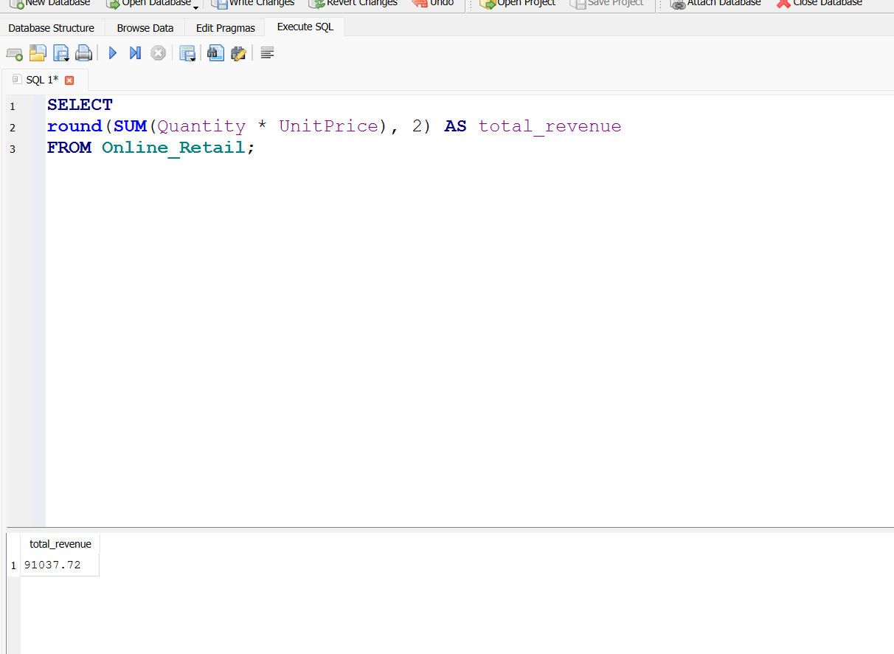
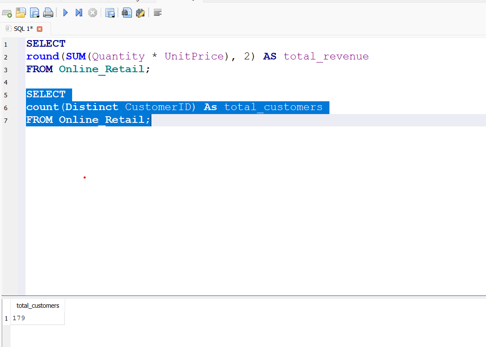
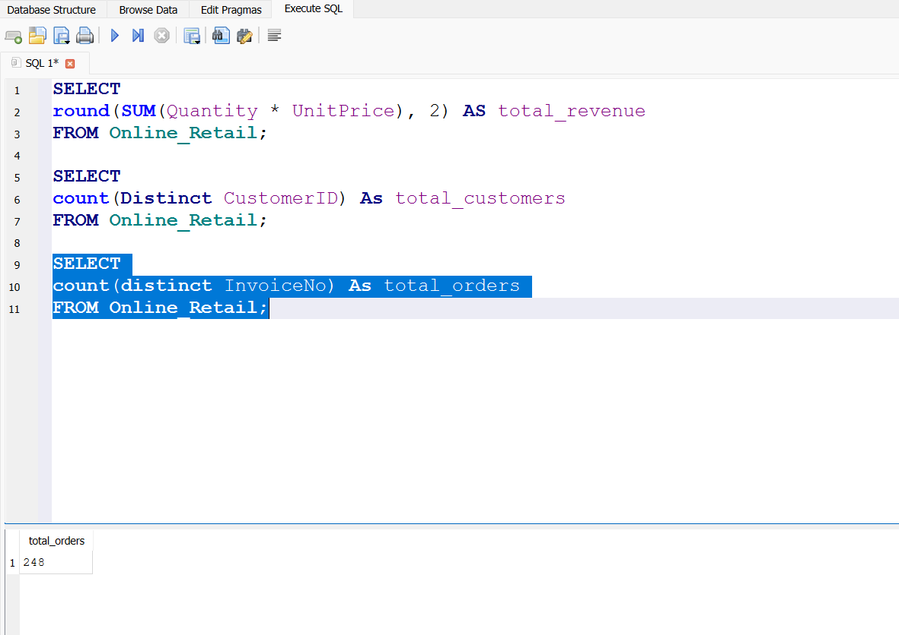
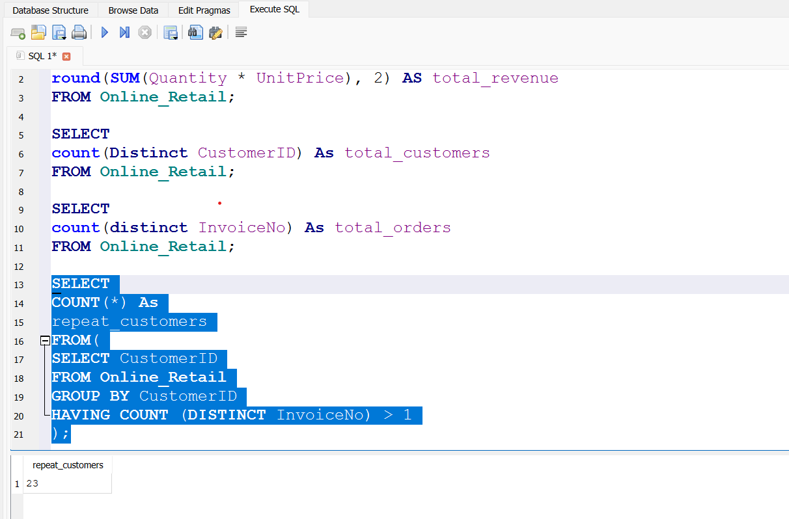
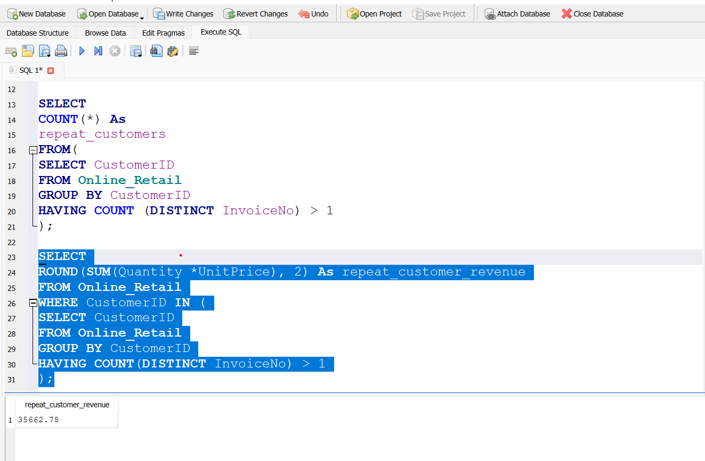
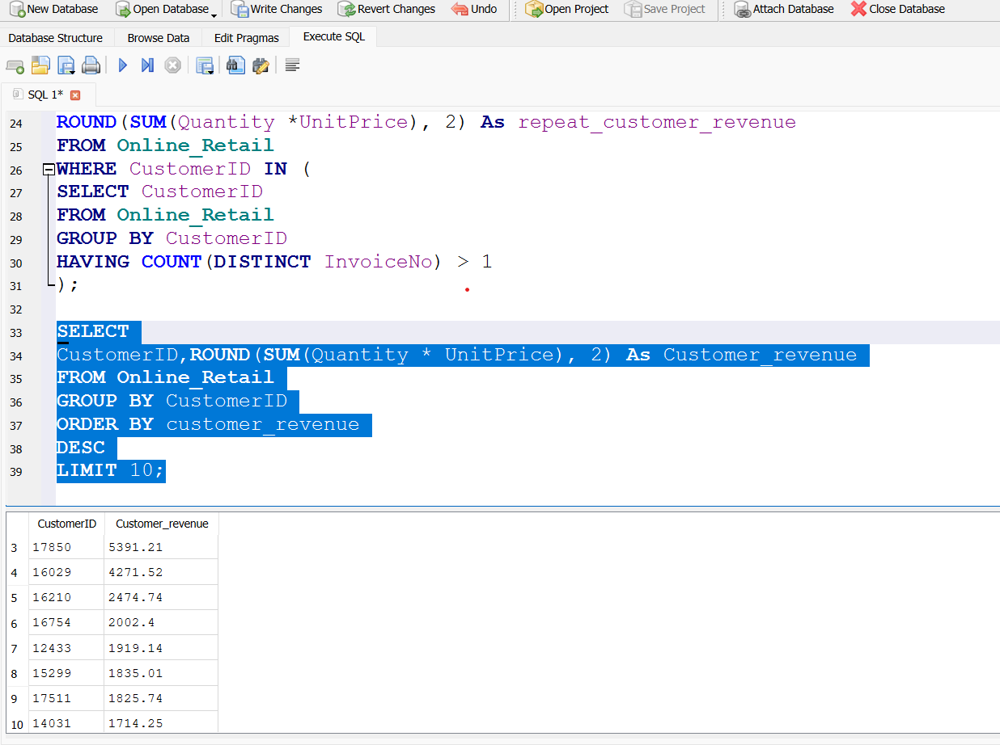
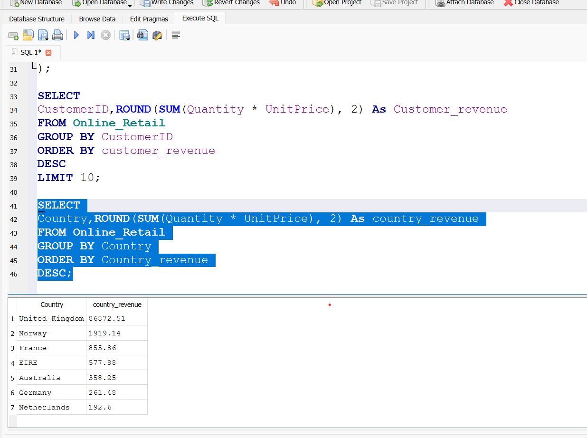
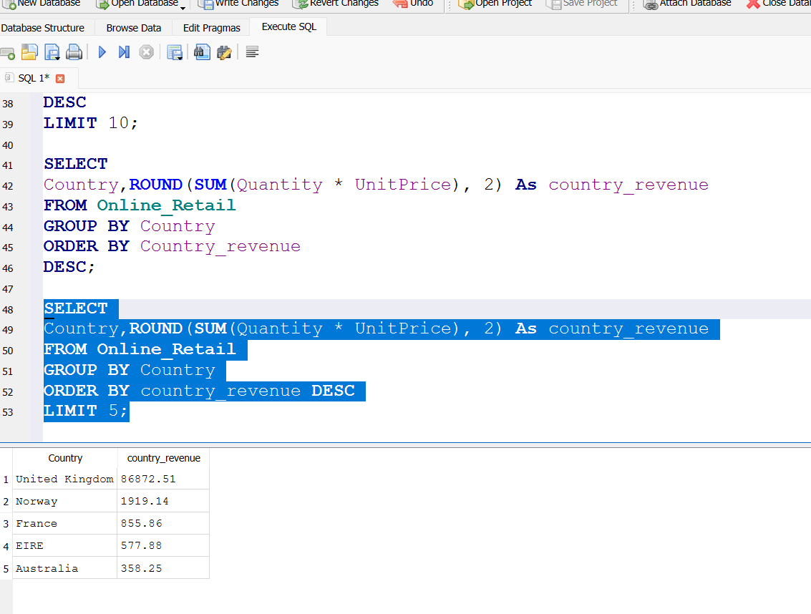
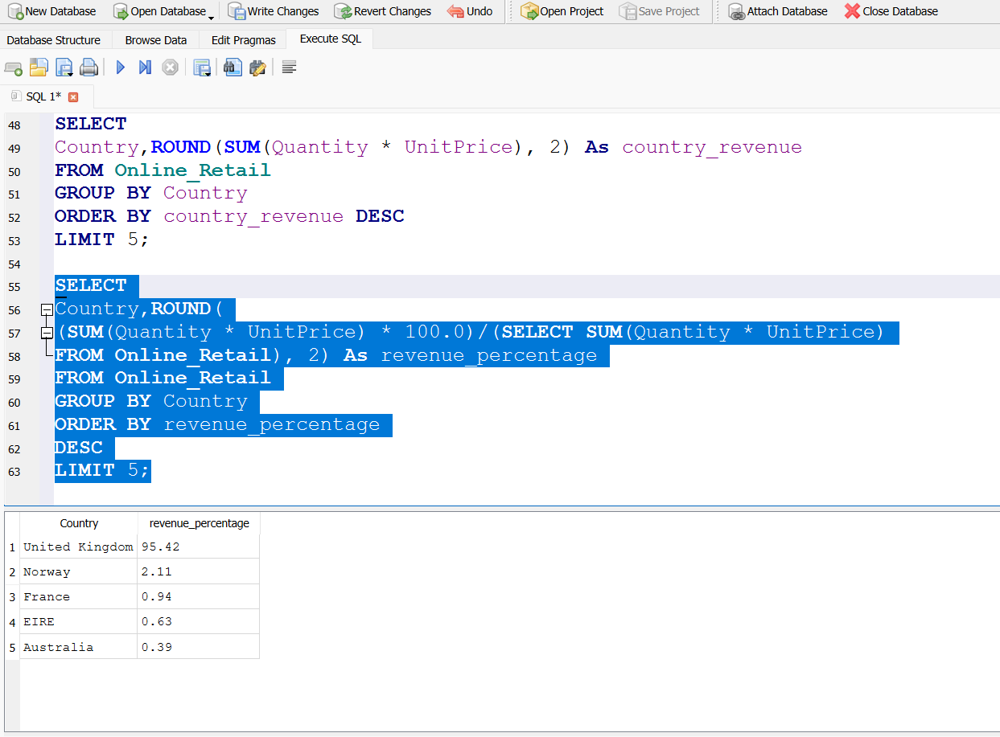

# Online Retail Exploratory Data Analysis (EDA)

## Project Overview
This project focuses on performing Exploratory Data Analysis (EDA) on an online retail dataset to understand customer purchasing behaviour, sales trends, and revenue patterns.

The analysis aims to uncover meaningful insights such as monthly sales performance, top customers by revenue, popular products, and overall business trends. These insights can help support data-driven decision-making in a retail business context.

## Dataset Description
The dataset contains transactional data from an online retail business. Each row represents a single transaction, including details such as invoice number, product description, quantity purchased, invoice date, unit price, customer ID, and country.

The data captures customer purchasing behaviour over time and allows for analysis of sales trends, customer value, and product performance.

## Tools Used
- Microsoft Excel
- GitHub
  
## Data Cleaning Steps
The dataset required several cleaning steps before analysis to ensure accuracy and reliability of insights.

- Removed cancelled transactions identified by invoice numbers starting with the letter "C".
- Removed records with negative or zero quantities and unit prices, as these represent returns or invalid transactions.
- Removed rows with missing customer IDs to enable meaningful customer-level analysis.
- Created a revenue field by multiplying quantity and unit price.
- Extracted invoice month from the invoice date to support time-based analysis.
  
## Exploratory Data Analysis
Exploratory Data Analysis was conducted using pivot tables to identify patterns and trends within the online retail data.

Monthly revenue analysis revealed fluctuations in sales performance, highlighting periods of higher customer activity and potential seasonality. Product-level analysis showed that a small number of products contributed a significant share of total revenue, indicating opportunities for focused inventory and marketing strategies.

Geographical analysis revealed that revenue was concentrated in a few key countries, while customer-level analysis showed that a small group of customers accounted for a large proportion of overall revenue. These findings highlight the importance of customer retention and targeted sales strategies.

## Key Insights
- Revenue showed noticeable variation across different months, suggesting seasonal purchasing behaviour.
- A small number of products generated the majority of total revenue.
- Revenue was heavily concentrated in a few countries, indicating core markets for the business.
- A limited number of high-value customers contributed significantly to overall revenue.

## Conclusion
This exploratory data analysis provided valuable insights into sales performance, customer behaviour, and product contribution within an online retail business. By cleaning and analysing the data, key revenue patterns, high-performing products, core markets, and high-value customers were identified.

The findings demonstrate how structured data analysis can support informed business decisions in areas such as inventory planning, customer retention, and sales strategy.

## Funnel Analysis (Excel)

### Objective
To analyse customer purchasing behaviour and identify drop-offs or retention gaps in the sales funnel.

### Funnel Stages Analysed
- Customers
- Orders
- Revenue

### Key Findings
- 100% conversion from customers to orders, indicating no checkout drop-off.
- No repeat purchases observed; each customer placed only one order.
- Revenue per customer equals revenue per order, highlighting a retention gap.

### Business Insight
Revenue is driven entirely by single purchases. While customer acquisition is effective, retention is weak.

### Recommendations
- Introduce loyalty incentives to encourage repeat purchases.
- Use remarketing emails to re-engage existing customers.
- Offer repeat-purchase discounts to increase customer lifetime value.

### Tools Used
- Microsoft Excel (Pivot Tables, Aggregations)

## SQL Project: Online Retail Funnel & Customer Analysis (SQLite)

This SQL project analyses an Online Retail dataset using **DB Browser for SQLite** to answer real business questions about revenue, customer behaviour, repeat purchases, and country performance. Each query is saved as a `.sql` file in the `sql/` folder, with a matching screenshot in the `image/` folder as proof of execution.

---

### Tools Used
- **SQLite** (DB Browser for SQLite)

### Dataset Table
- `Online_Retail`

### Revenue Formula Used
- `Revenue = Quantity * UnitPrice`

---

## Queries (13) — SQL Files + Output Screenshots

### Query 01 — Total Revenue
**Business question:** What is the total revenue generated?
- SQL file: `sql/01_total_revenue.sql`
- Screenshot: `image/online_retail_mysql_query_total_revenue.png`

---

### Query 02 — Total Customers
**Business question:** How many unique customers exist?
- SQL file: `sql/02_total_customers.sql`
- Screenshot: `image/online_retail_mysql_query_total_customers.png`

---

### Query 03 — Total Orders
**Business question:** How many unique orders were placed?
- SQL file: `sql/03_total_orders.sql`
- Screenshot: `image/online_retail_mysql_query_total_orders.png`

---

### Query 04 — Repeat Customers
**Business question:** Which customers made more than one purchase?
- SQL file: `sql/04_repeat_customers.sql`
- Screenshot: `image/online_retail_mysql_query_repeat_customers.png`

---

### Query 05 — Repeat Customer Rate (%)
**Business question:** What percentage of customers are repeat buyers?
- SQL file: `sql/05_repeat_customer_rate_percentage.sql`
- Screenshot: `image/online_retail_mysql_query_repeat_customer_rate_percentage.png`

---

### Query 06 — Revenue from Repeat Customers
**Business question:** How much revenue comes from repeat customers only?
- SQL file: `sql/06_repeat_customers_revenue.sql`
- Screenshot: `image/online_retail_mysql_query_repeat_customers_revenue.png`

---

### Query 07 — One-time vs Repeat Customers
**Business question:** How many customers are one-time buyers vs repeat buyers?
- SQL file: `sql/07_one_time_vs_repeat_customers.sql`
- Screenshot: `image/online_retail_mysql_query_one_time_vs_repeat_customers.png`

---

### Query 08 — Repeat Customer Order Counts
**Business question:** How many orders did each repeat customer place?
- SQL file: `sql/08_repeat_customers_order_counts.sql`
- Screenshot: `image/online_retail_mysql_query_repeat_customer_orders_each.png`

---

### Query 09 — Top Customers by Revenue (Top 10)
**Business question:** Which customers generate the most revenue?
- SQL file: `sql/09_top_customers_by_revenue.sql`
- Screenshot: `image/online_retail_mysql_query_top_customers_analysis.png`

---

### Query 10 — Revenue by Country (Full Ranking)
**Business question:** Which countries generate the most revenue overall?
- SQL file: `sql/10_revenue_by_country.sql`
- Screenshot: `image/online_retail_mysql_query_top_revenue_country.png`

---

### Query 11 — Top 5 Revenue Generating Countries
**Business question:** What are the top 5 revenue-generating countries?
- SQL file: `sql/11_top_5_revenue_generating_countries.sql`
- Screenshot: `image/online_retail_mysql_query_top_5_revenue_generating_countries.png`

---

### Query 12 — Top 5 Revenue Percentage by Country
**Business question:** What percentage of total revenue does each top country contribute?
- SQL file: `sql/12_top_5_revenue_percentage_by_country.sql`
- Screenshot: `image/online_retail_mysql_query_top_5_revenue_percentage_by_country.png`

---

### Query 13 — Funnel Baseline Analysis
**Business question:** What is the baseline snapshot of total customers and total orders?
- SQL file: `sql/13_funnel_baseline_analysis.sql`
- Screenshot: `image/online_retail_mysql_query_funnel_baseline_analysis.png`

---

## Key Takeaways (Business Value)
- Built a baseline view of **revenue, customers, and orders** for performance reporting.
- Measured **repeat customer behaviour** (count + repeat rate %) to support retention decisions.
- Quantified **repeat customer revenue contribution** to evaluate loyalty impact.
- Identified **top customers** (high-value segment) for VIP/CRM targeting.
- Ranked **countries by revenue** and calculated **top-country revenue share** to highlight revenue concentration.

---

## Next Steps

With exploratory data analysis and SQL-based customer and revenue analysis completed, the next steps for this project include:

- Deeper customer segmentation using SQL (e.g. RFM analysis or customer lifetime value estimation).
- Time-based analysis to understand purchasing trends by month or season.
- Profitability analysis by product category to identify high-margin items.
- Building interactive dashboards in Power BI to visualise revenue, customer behaviour, and repeat purchase metrics.
- Replicating parts of the analysis using Python for scalability and automation.

These extensions would allow the analysis to move from descriptive insights to more advanced, decision-support analytics.
